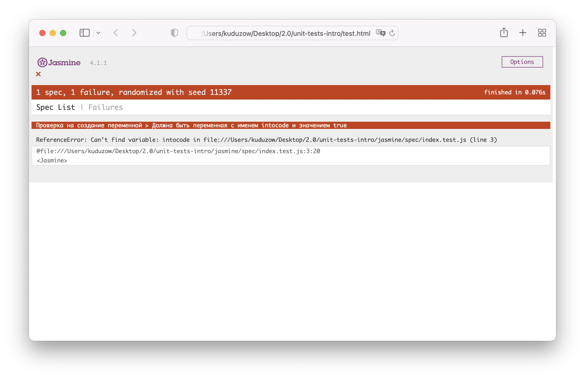
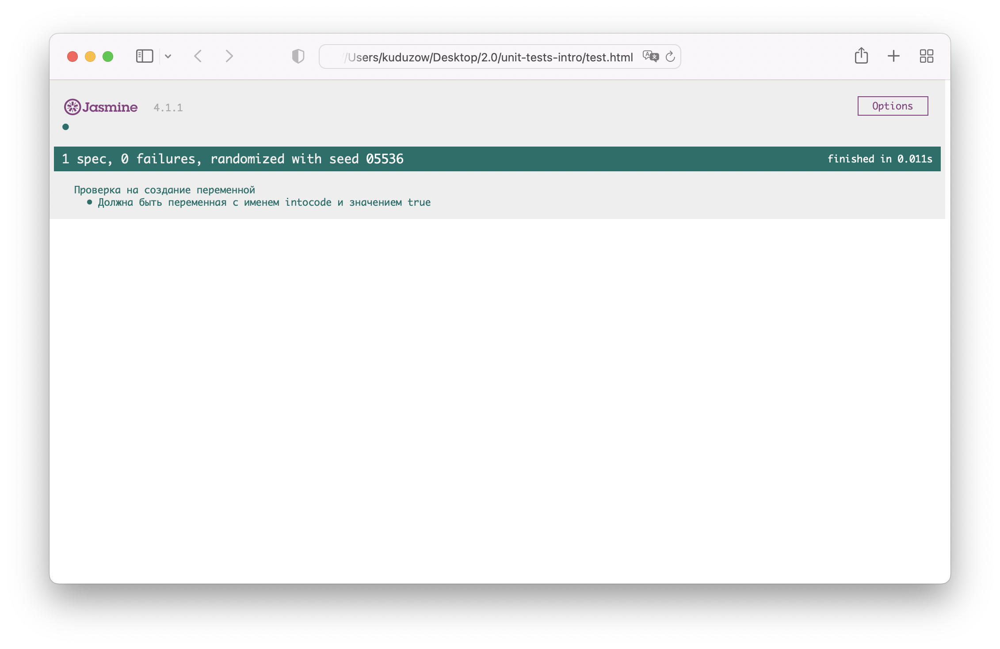

# Task: понять идею тестов

## Постановка задачи

Для выполнения дальнейших тасков нам нужно понять что такое тестирование в самых общих чертах.

Когда учат тестирование обычно учат то как писать тесты, какие библиотеки и подходы использовать. Однако, нам сейчас не нужно всё это. Единственное, что нас интересует - это что вообще такое тест и как его запустить.

Тест – это специальный код, который проверяет правильность работы другого кода.

Возьмём очень простой пример. Допустим у тебя есть функция `add(a, b)`, которая складывает числа `a` и `b` из своих параметров.

Ожидаемо, что при передаче в неё чисел `10` и `20` функция должна будет вернуть `30`. Любой другой результат будет являться ошибкой.

В таком случае можно написать тест, которому, абстрактно говоря, мы скажем: **вызови функцию `add(10, 20)` и посмотри какой будет ответ. Если ответ не равен `30` то выдай ошибку**.

Когда тест выдаёт ошибку, то говорят, что _тест провалился_, иначе говорят _тест прошел успешно_.

Если вдруг кто-то испортит нашу функцию, к примеру нечаянно поменяет название или вместо сложения сделает вычитание, то тест провалится и мы тут же узнаем, что проект работает неправильно.

Это самое общее описание принципа работы тестов. На практике проверки могут быть сложнее. Например, для одной функции может быть написано несколько тестов, а не один.

### Зачем тесты нужны нам сейчас?

Скоро наши таски будут становиться сложнее, а кода всё больше и больше.

Некоторые таски будут сопровождаться тестами. Успешность прохождения теста будет критерием правильности выполнения задачи.

## Subtask 1

Давай проверим работу тестов прямо сейчас.

Склонируй себе данный репозиторий на компьютер. Запусти в браузере файл `test.html`.

Ты должен увидеть примерно такую страницу:

Фраза "1 spec, 1 failure" означает, что был 1 тест и 1 провал. Да, тесты также называют спеками (spec).

Теперь открой файл `index.js`, создай в ней переменную с именем `intocode` и задай ей булевское значение `true`. Не забудь сохранить файл.

Если теперь обновить страницу `test.html`, то будет примерно следующая картина:

Зеленый цвет означает, что тест был пройден успешно и таск готов к сдаче.

⚠️ Никогда не изменяй в тасках файлы `test.html` и файлы из папки `jasmine`. Они нужны только для запуска теста.

## Закрываем задачу

Хотя от тебя сейчас и не требуется глубоких знаний по тестам, но если вдруг проснулся интерес и хочешь узнать о них подробнее, то прочитай [следующий материал на доке](https://doka.guide/js/how-to-test-and-why/).
